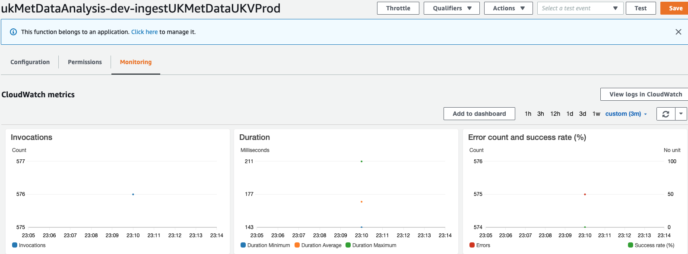

### Hello! 👋

My name is Pramit Mitra. I'm a Data Engineer with hands-on experience with Cloud Infrastructure and Dev-Ops Engineering. Outside of coding, I enjoy volleyball, hiking and weight training!

- 👀 I’m interested in Cloud Data Engineering
- 🌱 I’m currently learning AWS, Spark, Containerization
- 💞️ I’m looking to collaborate on Cloud Computing Features

Executing C code from VS Code

Compile: Shift + Command + B
Run: Command + R

Source:https://en.wikipedia.org/wiki/Pascal%27s_triangle

Pascal's triangle
From Wikipedia, the free encyclopedia
Jump to navigationJump to search

In Pascal's triangle, each number is the sum of the two numbers directly above it.
In mathematics, Pascal's triangle is a triangular array of the binomial coefficients. In much of the Western world, it is named after the French mathematician Blaise Pascal, although other mathematicians studied it centuries before him in India,[1] Persia (Iran)[2], China, Germany, and Italy.[3]

The rows of Pascal's triangle are conventionally enumerated starting with row n = 0 at the top (the 0th row). The entries in each row are numbered from the left beginning with k = 0 and are usually staggered relative to the numbers in the adjacent rows. The triangle may be constructed in the following manner: In row 0 (the topmost row), there is a unique nonzero entry 1. Each entry of each subsequent row is constructed by adding the number above and to the left with the number above and to the right, treating blank entries as 0. For example, the initial number in the first (or any other) row is 1 (the sum of 0 and 1), whereas the numbers 1 and 3 in the third row are added to produce the number 4 in the fourth row.
